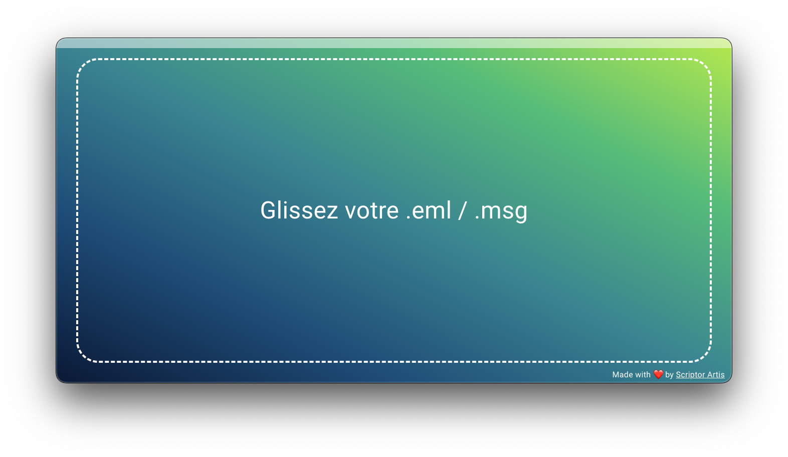

# EML & MSG

L'application EML&MSG développée par Scriptor Artis est conçue pour lire les formats de courrier électronique courants .eml et .msg. Cette application est spécifiquement conçue pour permettre la lecture de ces formats de fichiers et n'offre pas de fonctionnalités supplémentaires de gestion de courrier électronique telles que l'envoi ou la réception de courriels. Avec une interface moderne et facile à utiliser, vous pouvez facilement naviguer dans vos dossiers, rechercher des courriels spécifiques et même joindre des pièces jointes. Si vous recherchez une solution pour lire efficacement vos fichiers .eml et .msg, cette application est un choix idéal.